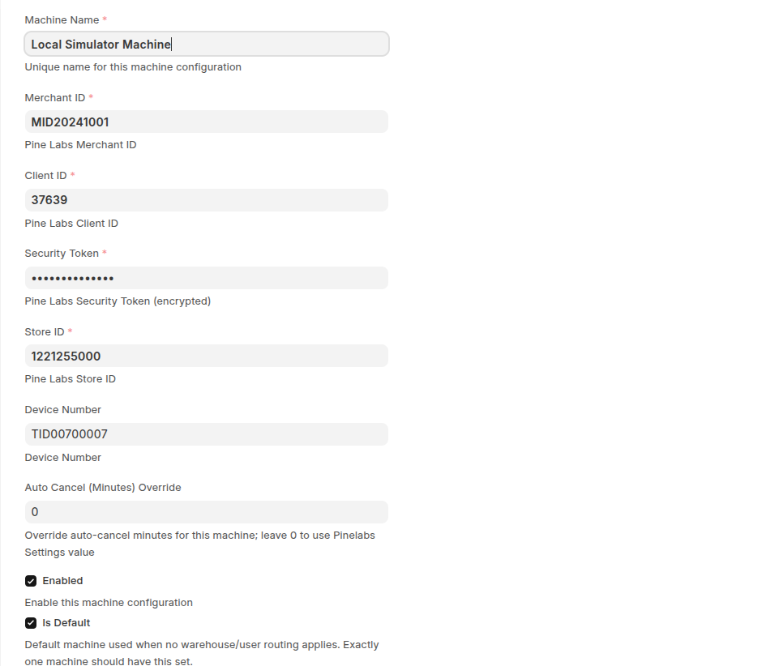
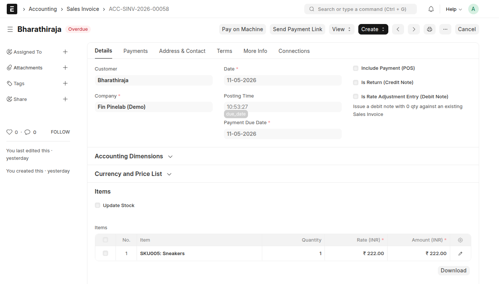
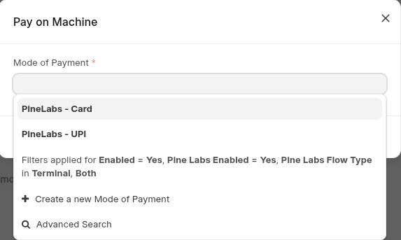
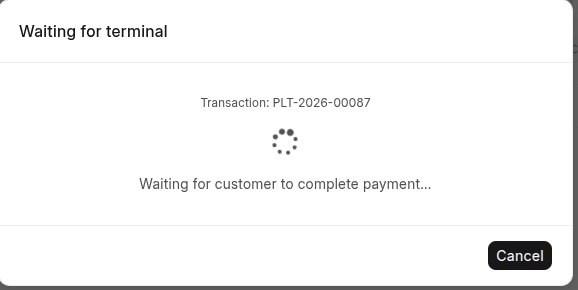
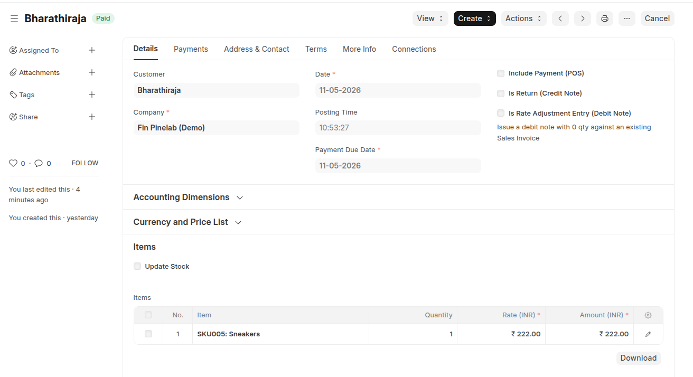
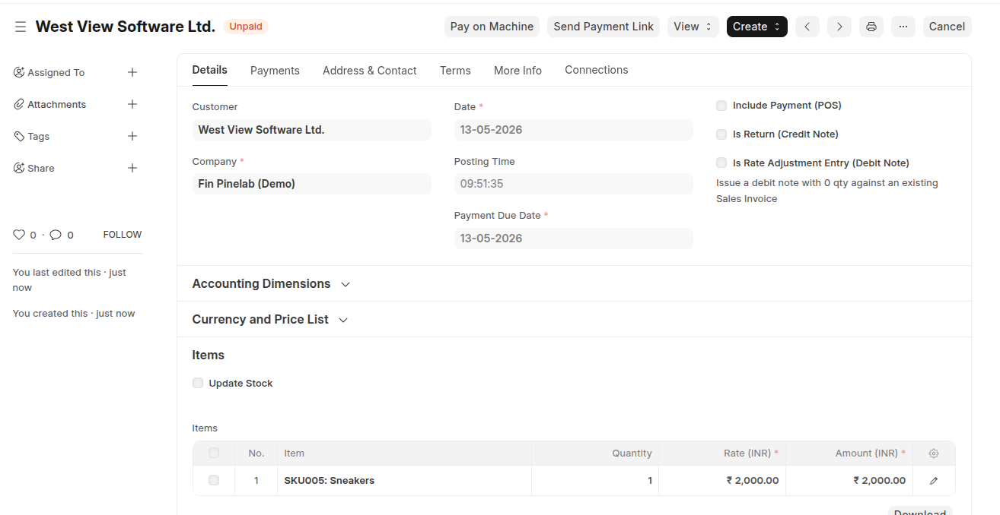
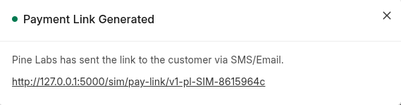
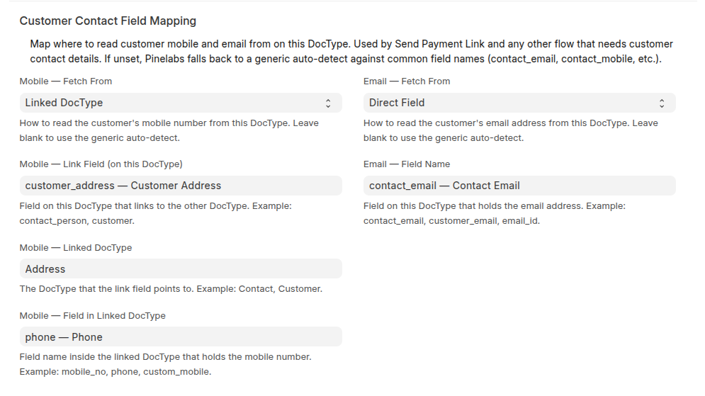
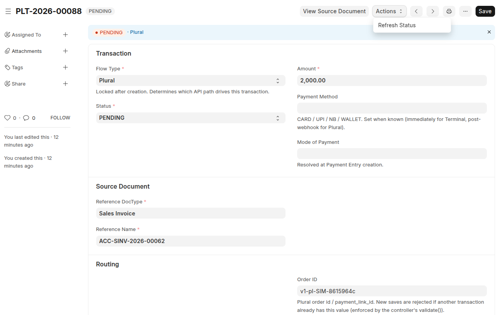

<div style="display: flex; justify-content: space-between; margin-bottom: 20px;">
    
    
</div>

<div align="center" markdown="1">

# Pinelabs Fin

Pine Labs payment integration for Frappe & ERPNext — take terminal payments or send hosted payment links straight from any invoice, with the Payment Entry created automatically when the customer pays. 

  

</div>

---

## Main features

**Pay on Machine (terminal):**
- Card and UPI on a physical Pine Labs Cloud terminal.
- Foreground "Waiting for terminal" modal + background cron reconciliation.
- Auto-creates the ERPNext Payment Entry on success.

**Send Payment Link (online):**
- Plural hosted checkout — card, UPI, netbanking, wallets.
- Pine Labs delivers the link by SMS and email automatically.
- Webhook + 1-minute reconcile cron mark the invoice **Paid** when the customer pays.

**Marketplace-clean integration:**
- Zero custom fields on Sales Invoice, POS Invoice, Payment Entry, Customer, Contact — or **Mode of Payment**. Pine Labs Modes are identified by name only.
- Three canonical Modes of Payment seeded on install: `PineLabs - Card`, `PineLabs - UPI`, `PineLabs - Payment Link`.
- All payment state lives in a dedicated `Pinelabs Transaction` doctype, linked via Dynamic Link.
- Supports Sales Invoice, POS Invoice, Payment Request natively; any custom payable doctype via the `create_payment_entry` API flag.

**Fail-fast before charging the customer:**
- Account-mapping pre-flight — the chosen Mode of Payment must have a default account configured for the source doc's company. If not, the API throws a clean error before contacting Pine Labs.
- Customer-resolution pre-flight (for PE creation) — the source doc's customer / Global Default must resolve. If not, error fires before charge.
- No more stuck-PENDING transactions: every misconfig surfaces *before* the gateway is called.

**Operations:**
- Multi-terminal routing — pick a terminal automatically by user, warehouse, or POS profile.
- Every API exchange is captured on the Pinelabs Transaction record (request, response, error).
- Whitelisted Python + JS APIs to drive the same flows from your own buttons / hooks / scripts.
- `create_payment_entry` parameter on every API — override the Payable Documents config per call (`0` = skip PE, `1` = force PE creation).

---

## How to Install

```bash
cd ~/frappe-bench
bench get-app https://github.com/<owner>/pinelabs_fin
bench --site <your-site> install-app pinelabs_fin
bench --site <your-site> migrate
bench build
bench restart
```

Upgrade later:

```bash
cd ~/frappe-bench/apps/pinelabs_fin
git pull
cd ~/frappe-bench
bench --site <your-site> migrate
```

Migrations are idempotent — `bench migrate` is safe to run any number of times.

---

## Setup and Use

Everything is configured in a single doctype: **Pinelabs Settings**. Open the desk Awesome Bar and type "Pinelabs Settings".

### Configure your Pine Labs machine

Open **Pinelabs Settings → Machines** and add one row per terminal.



| Field | What to put |
|---|---|
| **Machine Name** | Any short label (e.g. "Front counter") |
| **Client ID**, **Security Token**, **Merchant ID**, **Store ID**, **Terminal ID** | From your Pine Labs onboarding email |
| **Enabled** | ✅ |
| **Is Default** | ✅ on **exactly one** machine |

Save. The app can now talk to your terminal.

### Configure Plural (for Send Payment Link)

Skip this if you only use **Pay on Machine**. In **Pinelabs Settings → Plural API Configuration**:

| Field | What to put |
|---|---|
| **Enable Payment Links** | ✅ |
| **Plural Client ID** / **Plural Client Secret** | From your Pine Labs Plural dashboard |
| **Webhook Secret (HMAC)** | A random string ≥ 16 characters — you'll set the **same** value on the Plural dashboard |
| **Plural API Base URL** | Leave blank for sandbox. For production use `https://api.pluralpay.in` |

Click **Test Plural Connection** to verify. Then on the Plural dashboard, register the webhook URL:

```
https://<your-erpnext-host>/api/method/pinelabs_fin.api.webhook.handle_webhook
```

### Configure Mode of Payment accounts (required)

Each of the three canonical Modes of Payment (`PineLabs - Card`, `PineLabs - UPI`, `PineLabs - Payment Link`) needs a default ledger account per company. Without this, the Payment Entry created on payment success would have nowhere to post.

For **each** of the three modes:

1. Awesome Bar → **Mode of Payment** → pick the row (e.g. `PineLabs - Card`).
2. Scroll to the **Accounts** child table.
3. Add a row: **Company** = your company, **Default Account** = the bank / cash account that should receive Pine Labs settlements.
4. Save.

If you skip this and click Pay on Machine / Send Payment Link, the app throws a clear error **before** contacting Pine Labs — the customer is never charged for a payment we can't book.

### Configure Payable Documents

In **Pinelabs Settings → Payable Documents**, add one row per ERPNext doctype that should show the payment buttons.


| Field | What to put |
|---|---|
| **DocType** | Source doctype (e.g. `Sales Invoice`) |
| **Enabled** | ✅ |
| **Pay on Machine** | ✅ to show the terminal button |
| **Send Payment Link** | ✅ to show the payment-link button |
| **Amount Field** | Field holding the payable amount (e.g. `base_grand_total`) |
| **Create Payment Entry** | ✅ for Sales Invoice / POS Invoice / Payment Request |

Save. Open any submitted record of that doctype — the two buttons appear at the top.



### Pay on Machine — when the customer is at the counter

1. Open the submitted invoice.
2. Click **Pay on Machine**.
3. Pick **PineLabs - Card** or **PineLabs - UPI** and click **Start Payment**.

   

4. The "Waiting for terminal" window appears and the Pine Labs machine beeps with the bill.

   

5. Customer taps card or scans UPI. The invoice flips to **Paid** and a Payment Entry is created automatically.

   

End-to-end takes ~5–10 seconds.

### Send Payment Link — when the customer is elsewhere

1. Open the submitted invoice. Make sure it has an email or mobile number resolvable to the customer.
2. Click **Send Payment Link**.

   

3. A green popup shows the generated link.

   

4. Pine Labs delivers it to the customer by SMS and email.
5. When the customer pays, the invoice flips to **Paid** within a minute.

### Customer Contact Field Mapping

The app needs an email / mobile to give Plural. In each Payable Documents row, **Customer Contact Field Mapping** tells the app where to find them.



- **Direct Field** — the value sits on the source doctype itself (e.g. `contact_email` on Sales Invoice).
- **Linked DocType** — the value sits on a linked doctype (e.g. mobile on Address via `customer_address` → field `phone`).

Mobile and Email are independent — pick whichever mode fits each. Leave both blank to let the app auto-detect common field names (`mobile_no`, `email_id`, `contact_email`, …).

### Optional — multi-terminal routing

Two or more terminals? Switch **Terminal Routing Mode** to `Mapping` and add rules.


The app picks the right terminal automatically based on the user at the till, the warehouse on the invoice, or the active POS profile. No rule matches → falls back to the default machine.

### Track every payment

Every payment attempt lands on one **Pinelabs Transaction** record. Status moves through `INITIATED → PENDING → SUCCESS / FAILED / CANCELLED`. The record carries the full request and response payloads for debugging.



Click **Actions → Refresh Status** to ask Pine Labs on demand. Otherwise a 1-minute scheduler reconciles in the background.

---

## API

Three whitelisted Python entry points — callable from JS or REST.

```python
# Pay on Machine
pinelabs_fin.api.terminal.initiate_terminal_payment(
    reference_doctype,           # required — e.g. "Sales Invoice"
    reference_name,              # required — e.g. "ACC-SINV-2026-00054"
    mode_of_payment,             # required — "PineLabs - Card" or "PineLabs - UPI"
    amount=None,                 # optional — defaults to source doc's outstanding
    create_payment_entry=None,   # optional — 0 / 1; see "create_payment_entry" below
)

# Send Payment Link
pinelabs_fin.api.plural.initiate_payment_link(
    reference_doctype,           # required
    reference_name,              # required
    flow="all_methods",          # optional — "all_methods" / "upi_only" / "card_only"
    expiry_minutes=None,         # optional — defaults to 1440 (24 h)
    customer_email=None,         # optional — inline override
    customer_mobile=None,        # optional — inline override
    create_payment_entry=None,   # optional — 0 / 1; see "create_payment_entry" below
)

# Poll a Pay-on-Machine transaction
pinelabs_fin.api.terminal.check_terminal_status(
    transaction_name,            # required — the PLT-... from initiate_terminal_payment
    create_payment_entry=None,   # optional — late override of the same flag
)
```

### `create_payment_entry`

A per-call override of the Payable Documents row's `Create Payment Entry` setting. Useful when calling the APIs from your own custom button on a doctype that doesn't have a Payable Documents row (or has one configured for mapped-field finalization).

| Value | Effect |
|---|---|
| `1` | Force PE creation on success. Runs the account-mapping + customer-resolution pre-flight before contacting Pine Labs |
| `0` | Skip PE creation. Falls back to mapped-field finalization if configured, otherwise leaves the source doc untouched |
| omitted / `None` | Use the Payable Documents row's setting (or "no PE" if the source doctype isn't PE-native and has no row) |

For a custom doctype with `create_payment_entry=1`, the app builds the PE manually since ERPNext's `get_payment_entry` helper only supports Sales Invoice / POS Invoice / Payment Request. The source doctype should expose a `customer` Link field (or fall back to ERPNext's Default Customer in Global Defaults) so `party_type = Customer` can be set on the PE.

Plus two JS helpers on `frappe.pinelabs.*` that wrap the API and open the same UI the built-in buttons use:

```javascript
frappe.pinelabs.start_terminal_payment(
  {
    reference_doctype: frm.doctype,
    reference_name: frm.docname,
    mode_of_payment: "PineLabs - Card",
    create_payment_entry: 1,   // optional
  },
  { on_settled: () => frm.reload_doc() },
);

frappe.pinelabs.start_payment_link(
  {
    reference_doctype: frm.doctype,
    reference_name: frm.docname,
    flow: "all_methods",
    create_payment_entry: 1,   // optional
  },
  { on_link: () => frm.reload_doc() },
);
```

---

## Limitations

- **Refunds** are not initiated by the app — use Pine Labs' own refund flow, then reflect the change in ERPNext manually.
- **Currency** — only INR (Plural's API does not accept other currencies in this release).
- **Automatic Payment Entry** — works natively for Sales Invoice, POS Invoice and Payment Request. Custom doctypes can also create PEs by passing `create_payment_entry=1` to the API (and exposing a `customer` Link field or using ERPNext's Default Customer). Otherwise the app uses the mapped-status-field path or the permissive "no PE" path.
- **Renaming the canonical Modes of Payment** (`PineLabs - Card` / `PineLabs - UPI` / `PineLabs - Payment Link`) breaks the integration silently — Pine Labs modes are identified by name, not by custom fields.

---

## Dependencies

- Frappe v15
- ERPNext v15
- Python 3.10+
- MariaDB 10.6+ with InnoDB

---

## License

MIT — see [LICENSE](LICENSE).

---

<p align="center"><strong>Built with Frappe&nbsp; · &nbsp;by Finstein</strong></p>

<p align="center">
  
  &nbsp;&nbsp;&nbsp;&nbsp;&nbsp;&nbsp;
  
</p>
